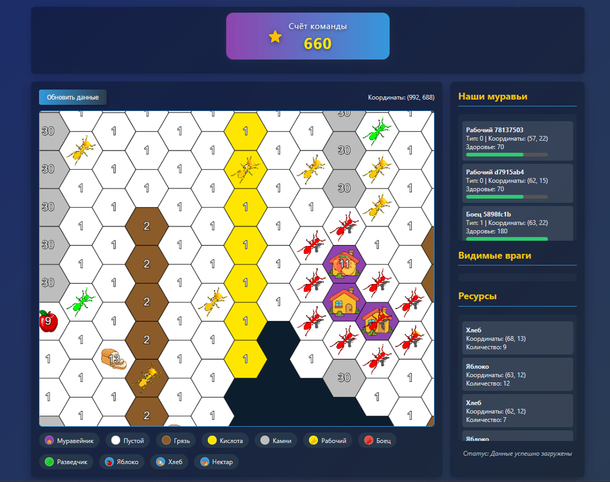

# Геймтон DatsPulse
Проект, написанный в рамках геймтона [DatsPulse](https://gamethon.datsteam.dev/datspulse) командой **Vyatich Enjoyers**.
Кто знает, какие темные секреты скрывают эти файлы с кодом?

[Документация геймтона](https://games.datsteam.dev/static/datspulse/docs/)

## Структура проекта
`.readme` - папка с файлами для README.md
`archive` - папка со старыми весриями проекта
`controller` - модуль для управления игрой
`json` - папка с примерами ответов сервера
`models` - папка с моделями игры
`visualizer` - визуализатор данных

## Запуск
Оно вам не надо. Но, если что, запускайте ```main.py```
Для отображения визуализатора открывайте `index.html` внутри папки `visualizer`


